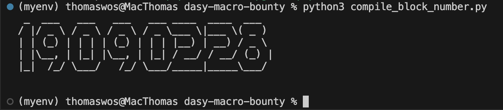

# dasy-macro-bounty

Dasy macro submitted as part of a bounty organized by Ethereum Melbourne.

The macro stores in a string the current ethereum block number in ascii art.

## Installation

```bash
python -m venv myenv
source myenv/bin/activate
pip install -r requirements.txt
```

## Compilation

Compile and print the `blockNumber` variable

```
python compile_block_number.py
```



## Other

Compile:

```
dasy block_number.dasy
```

Checksum:

```
dasy block_number.dasy | md5
```
